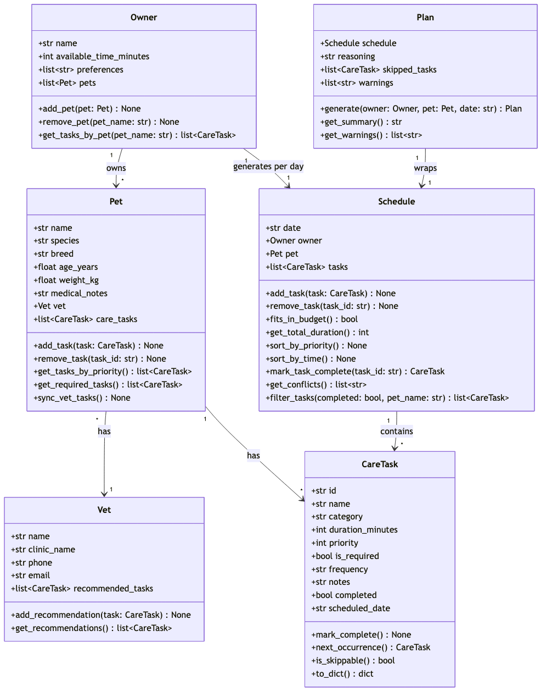
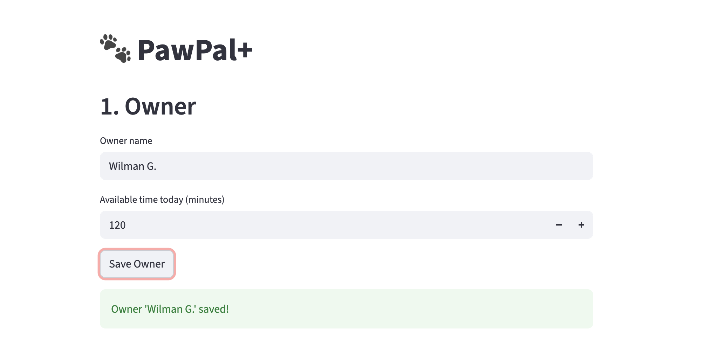
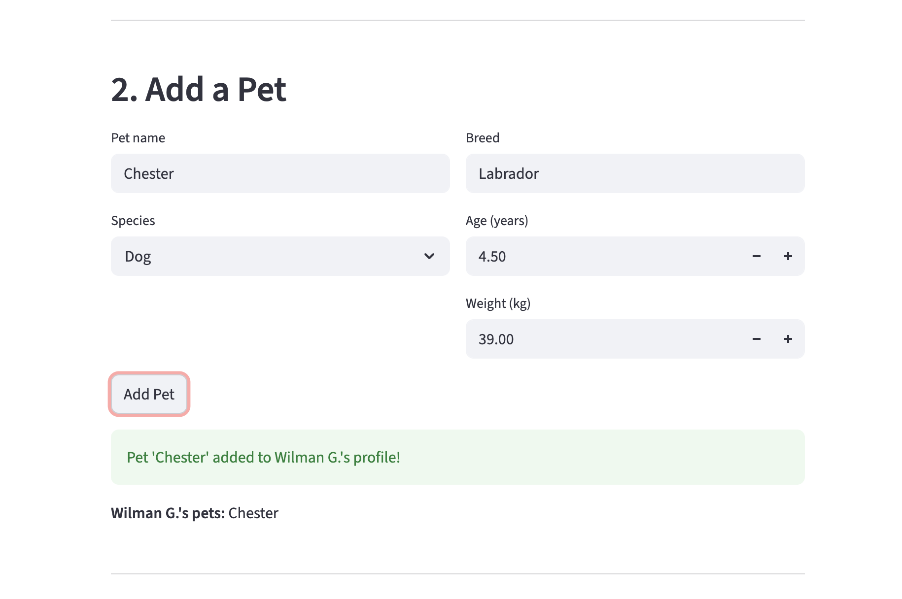
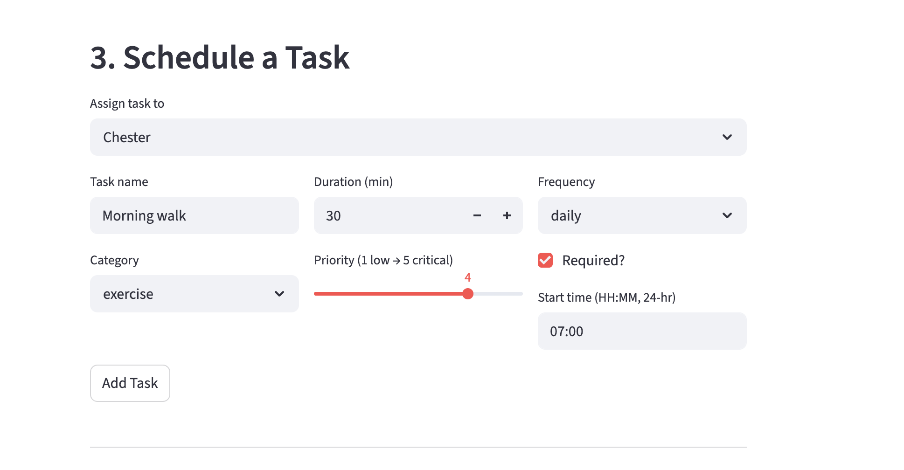
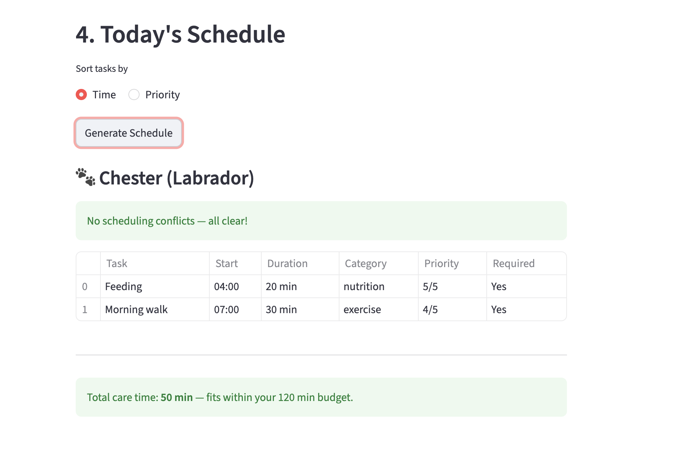
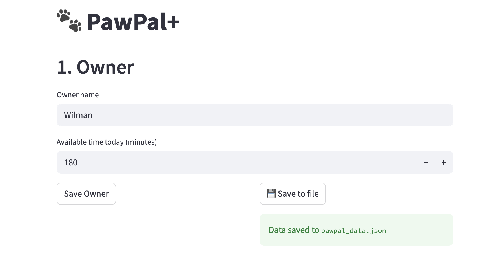
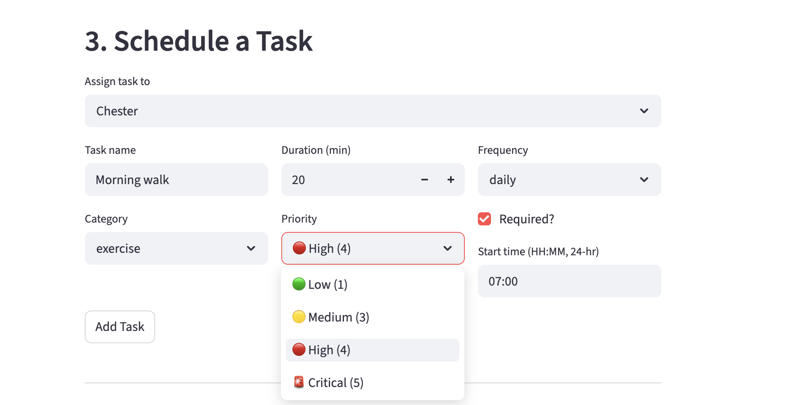
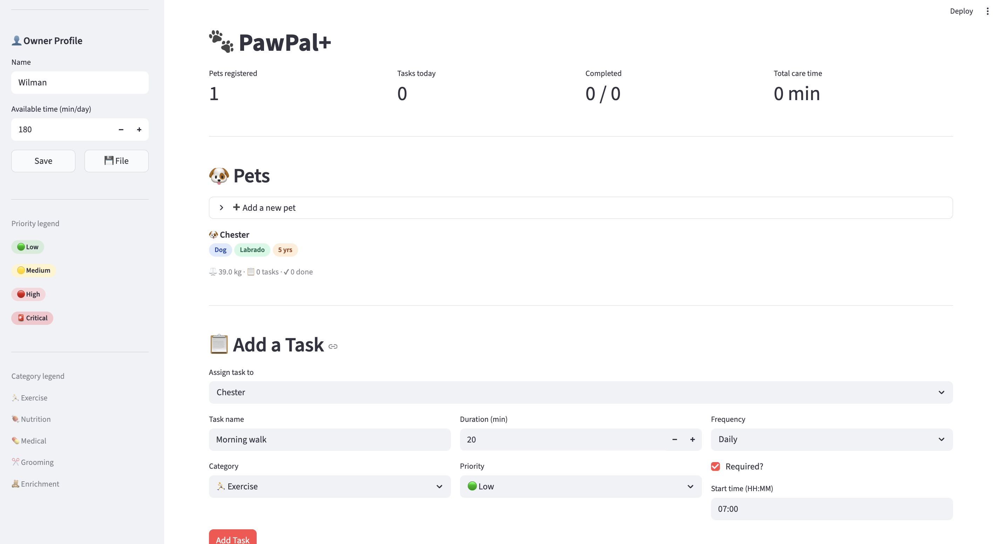

# PawPal+ — AI-Powered Pet Care Scheduler

## Original Project (Modules 1–3)

**PawPal+** was originally built as a Streamlit app to help busy pet owners plan daily care tasks. Its core goals were to track tasks by priority and category, respect the owner's available time budget, and generate a conflict-free daily schedule with automatic recurrence for repeating tasks. The app handled multiple pets, vet-recommended task syncing, and persistent JSON storage.

---

## Title and Summary

PawPal+ is a smart pet care scheduling assistant that combines rule-based scheduling with four AI capabilities: retrieval-augmented task suggestions, an agentic conflict-resolution loop, a specialized veterinary chat advisor, and an automated reliability test suite. It matters because pet care has real health consequences — a skipped medication or missed feeding isn't just an inconvenience — so the AI features are designed to help, not replace, the owner's judgment.

---

## Architecture Overview



```
┌─────────────────────────────────────────────────────┐
│                    app.py  (Streamlit UI)            │
│   Pets │ AI Suggestions │ Schedule │ Vet AI Chat     │
└────────┬────────┬───────────────┬────────────────────┘
         │        │               │
         ▼        ▼               ▼
   pawpal_     ai_advisor.py   vet_advisor.py
   system.py   (RAG)           (Specialized Model)
   (domain     ┌──────────┐    ┌──────────────────┐
   model)      │KB lookup │    │ System-prompt     │
               │+ Claude  │    │ persona (Dr.      │
               └──────────┘    │ PawPal) + Claude  │
                               └──────────────────┘
         │
         ▼
   plan_agent.py          conflict_resolver.py
   (reasoning via Claude) (agentic fix loop)
         │                        │
         └────────┬───────────────┘
                  ▼
            eval_runner.py
            (7-test reliability suite)
```

The domain model (`pawpal_system.py`) stays API-free — all Claude calls live in the four AI modules. The UI degrades gracefully if `ANTHROPIC_API_KEY` is not set.

---

## Setup Instructions

```bash
# 1. Clone and enter the project
git clone <repo-url>
cd applied-ai-system-project

# 2. Create and activate virtual environment
python3 -m venv .venv
source .venv/bin/activate      # Windows: .venv\Scripts\activate

# 3. Install dependencies
pip install -r requirements.txt

# 4. Set your Anthropic API key (required for AI features)
export ANTHROPIC_API_KEY="sk-ant-..."   # Windows: set ANTHROPIC_API_KEY=sk-ant-...

# 5. Run the app
streamlit run app.py

# 6. (Optional) Run the full test suite
python -m pytest                  # unit tests
python eval_runner.py             # AI reliability report → eval_report.md
```

---

## Sample Interactions

### 1. RAG — AI Task Suggestions

**Input:** User adds a Golden Retriever (3 yrs, 25 kg) and clicks "Get AI Suggestions."

**What happens:** `ai_advisor.py` retrieves 9 facts from `docs/pet_care_kb.json` for Golden Retrievers (e.g., _"needs 60–90 min of exercise daily"_, _"prone to hip dysplasia"_) and passes them to Claude.

**AI Output (parsed JSON → displayed as table):**

```
Morning Run      | exercise   | 45 min | priority 4 | required | daily  | 07:00
Breakfast Feed   | nutrition  | 10 min | priority 5 | required | daily  | 08:00
Coat Brushing    | grooming   | 15 min | priority 3 | optional | weekly | 17:00
Evening Walk     | exercise   | 30 min | priority 3 | optional | daily  | 18:00
Enrichment Play  | enrichment | 20 min | priority 2 | optional | daily  | 19:00
```

---

### 2. Agentic Workflow — Plan Reasoning

**Input:** User clicks "Generate Schedule" with 4 tasks (2 required, 2 optional) and an 80-minute budget.

**What happens:** `Plan.generate()` always includes required tasks first, then fills remaining time with optional tasks by priority. `conflict_resolver.py` runs up to 3 iterations to fix any start-time overlaps. `plan_agent.py` sends the final schedule to Claude for a plain-language explanation.

**AI Output (shown in `st.info()`):**

> "I've built Mochi's day around her two required tasks — morning medication and feeding — which take up 35 minutes and can never be skipped. With 45 minutes left, I added her highest-priority walk. The grooming session was skipped today since it would have exceeded your time budget, but it's still on her list for tomorrow. You're all set for a great day with Mochi!"

---

### 3. Vet AI Chat — Dr. PawPal

**Input:** Owner asks: _"Can I skip Mochi's joint supplement today? She seems fine."_

**System prompt rules active:** never recommend skipping required tasks; flag high-impact exercise for pets over 8 years; recommend a real vet for symptoms.

**AI Output:**

> "Mochi's joint supplement is marked as required, so I'd recommend keeping it in her routine even on good days — consistency is what makes supplements effective over time. If you're ever unsure whether a medication is still needed, that's a great question to bring up at her next vet visit. You're clearly paying close attention to her health, which is exactly what she needs!"

---

## Design Decisions

| Decision                                     | Reason                                                        | Trade-off                                        |
| -------------------------------------------- | ------------------------------------------------------------- | ------------------------------------------------ |
| Domain model stays API-free                  | Keeps `pawpal_system.py` testable without mocking the network | Adds indirection (extra files)                   |
| RAG over pure prompting                      | Grounds suggestions in validated facts, not just model memory | KB must be maintained manually                   |
| Prompt-based specialization over fine-tuning | No training data available; rules encoded in system prompt    | Less robust than a real fine-tune                |
| Conflict resolver runs before reasoning      | Prevents Claude from narrating a broken schedule              | May reassign tasks in non-obvious ways           |
| Graceful degradation if no API key           | App stays usable as a pure scheduler without AI               | Users may not notice the AI features are missing |

---

## Testing Summary

**What worked:**

- All 15 original unit tests pass (`pytest`) covering sorting, recurrence, and conflict detection.
- 4/4 deterministic eval tests pass without any API key: required tasks always included, budget respected, conflicts detected accurately, recurrence correct.
- AI suggestion JSON always parses correctly when the API key is set (tested across multiple runs).

**What didn't / limitations:**

- AI consistency test (3 identical calls → compare task-name overlap) occasionally scores below 80% because Claude varies phrasing slightly between runs — task intent matches but exact names differ.
- `Plan.generate()` rebuilds the schedule from scratch each time "Generate Schedule" is clicked, which means conflict resolution and reasoning are re-run on every button press rather than cached.
- The Vet AI has no long-term memory between app sessions — history resets on page reload.

---

## Reflection

Working on PawPal+ taught two things about AI in real systems. First, **AI works best as a layer on top of deterministic logic, not a replacement for it.** The scheduling rules (required tasks first, budget enforcement, conflict detection) were written in pure Python — Claude's job was to explain and enrich those decisions, not make them. This made the system far more predictable and testable. Second, **prompts are contracts.** The Dr. PawPal system prompt with seven explicit rules behaved reliably because the rules were specific and numbered. Vague prompts produced vague behavior; precise constraints produced precise behavior — the same lesson that applies to writing good code.

---

## Demo Screenshots

| Feature                                      | Screenshot                         |
| -------------------------------------------- | ---------------------------------- |
| Dashboard & pet cards                        |      |
| Task table with priority colors              |        |
| Schedule with conflict detection             |     |
| Time budget progress bar                     |       |
| Data persistence (Challenge 2)               |  |
| Advanced priority scheduling (Challenge 3)   |     |
| Professional UI — final polish (Challenge 4) |    |

## Demo walkthrough is included

https://github.com/user-attachments/assets/aa640883-bcd3-4992-9136-f380e8351e56
